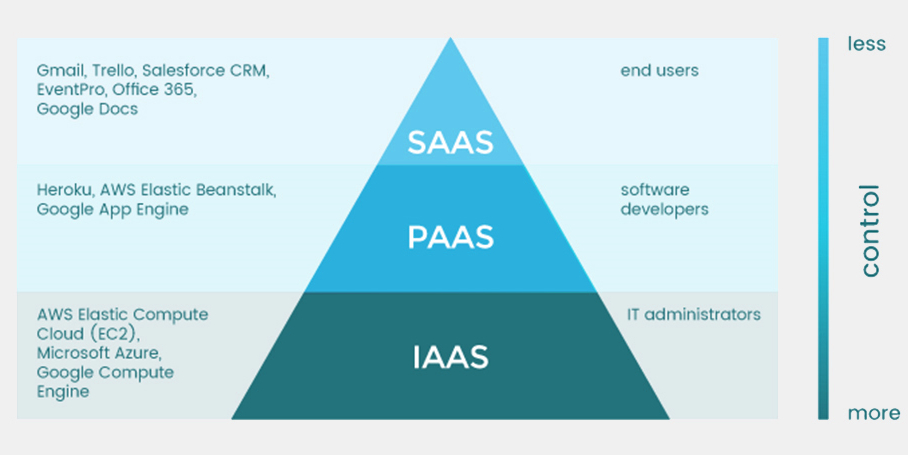
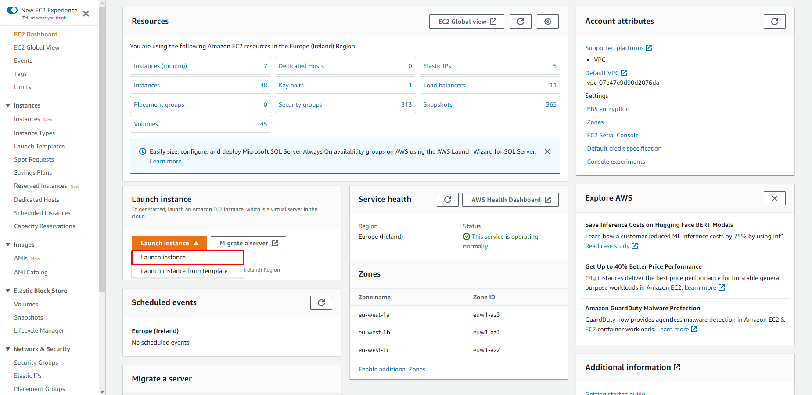
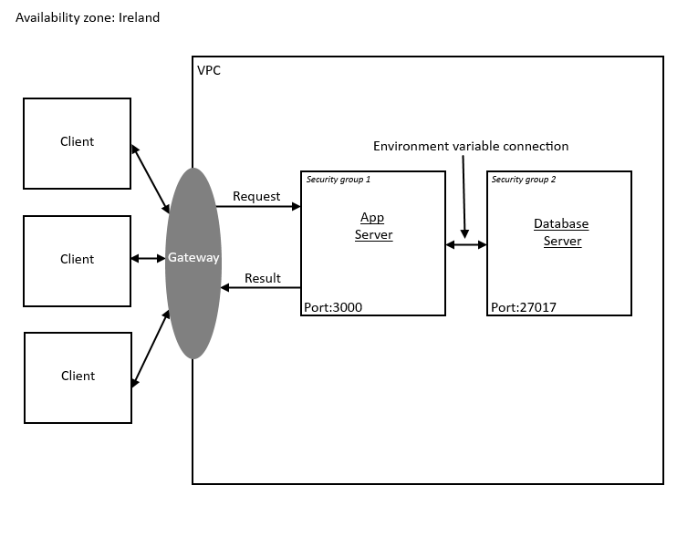
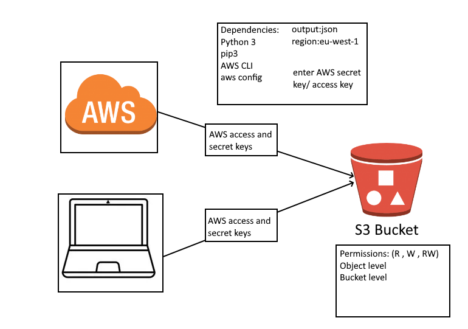

# Cloud Computing

## What is cloud computing?
Cloud computing is the on-demand availability of computer system resources, especially data storage and computing power, without direct active management by the user. Large clouds often have functions distributed over multiple locations, each of which is a data center.

## Serverful Models


### Software as a Service (SaaS)
 - Cloud provider gives access to applications on a subscription basis
### Platform as a Service (PaaS)
 - Cloud provider gives access to servers with operating systems and tools
### Infrastructure as a Service (IaaS)
 - Cloud providergives access to bare servers
## Why should you use cloud computing and its benefits

- Ease of use
- Flexibility
- Robustness
- Cost
### Flexibility
  1. Scalability: Cloud infrastructure scales on demand to support fluctuating workloads.
  2. Storage options: Users can choose public, private, or hybrid storage offerings, depending on security needs and other considerations.
  3. Control choices: Organizations can determine their level of control with as-a-service options. These include software as a service (SaaS), platform as a service (PaaS), and infrastructure as a service (IaaS).
  4. Tool selection: Users can select from a menu of prebuilt tools and features to build a solution that fits their specific needs.
  5. Security features: Virtual private cloud, encryption, and API keys help keep data secure.

### Efficiency

 1. Accessibility: Cloud-based applications and data are accessible from virtually any internet-connected device.
 2. Speed to market: Developing in the cloud enables users to get their applications to market quickly.
 3. Data security: Hardware failures do not result in data loss because of networked backups.
 4. Savings on equipment: Cloud computing uses remote resources, saving organizations the cost of servers and other equipment.
 5. Pay structure: A “utility” pay structure means users only pay for the resources they use.

### Strategic value
 1. Streamlined work: Cloud service providers (CSPs) manage underlying infrastructure, enabling organizations to focus on application development and other priorities.
 2. Regular updates: Service providers regularly update offerings to give users the most up-to-date technology.
 Collaboration: Worldwide access means teams can collaborate from widespread locations.
 1. Competitive edge: Organizations can move more nimbly than competitors who must devote IT resources to managing infrastructure.


## Who is AWS?
Amazon Web Services provides on-demand cloud computing platforms and APIs to individuals, companies, and governments, on a metered pay-as-you-go basis. These cloud computing web services provide distributed computing processing capacity and software tools via AWS server farms.

Some companies who use AWS:
 - Adobe
 - Docker
 - Netflix
 - Ubisoft
 - UCAS
 - Spotify
 - Sony

## Cap-ex vs Op-ex

 - Capital expenditures (CapEx) are major purchases a company makes that are designed to be used over the long term. 
   - buildings 
   - equipment 
   - machinery
   - vehicles
 - Operating expenses (OpEx) are the day-to-day expenses a company incurs to keep its business operational.
   - utilities
   - property taxes
   - cost of goods sold (COGS)

## Setup VM instance on AWS

1. Go to the EC2 page on AWS and click on this button (labeled in red)



2. Provide all information asked (apart from Advanced at the bottom, unless needed)
  1. Ensure you select the appropriate operating system and plan so you don't get charged
  2. Select key pair if you have it, if not create a new one
  3. Select your network security group (create a new one if you don't have one)
  4. Allow http trafic if you need to host website
      1. Not https as you probably do not have the required key
  5. If you want to enable SSH connection make sure you use your IP instead of the default `0.0.0.0/0` 
  6. You can use a different amount of storage if you want but 8GiB should be enough
3. Click on `Launch Instance` if ready
4. If you recieve any errors try to fix them and try again
5. Go to the Instances tab on the left and click it, you should see your instance running or initialising

## Editing incoming rules for network security
1. Head to your instace tab (code with letters and numbers that has a typical hyperlink look)
2. Go to the Security tab and click on the hyperlinked security group code
3. From there at the bottom right you should see "Edit inbound rules"
   1. Go in there and create any rule for any port you want 

## How to set up reverse proxy with nginx

1. Go to your home location (default location, no folders)
2. `cd /etc/nginx/sites-available`
3. `sudo nano default` - ensure you use sudo, otherwise you wont be able to edit
4. look for the server block
5. within server, look for location block
6. write the following commands (ensure any other lines are deleted from that block):

    ```
        location / {
                proxy_pass http://localhost:8080;
                proxy_http_version 1.1;
                proxy_set_header Upgrade $http_upgrade;
                proxy_set_header Connection 'upgrade';
                proxy_set_header Host $host;
                proxy_cache_bypass $http_upgrade;
            }
    ```

7. replace "8080" with whatever port you need
8. Press Ctrl + x to begin exit
9. Press Y to agree to changes
10. Press Enter to save and exit
11. sudo nginx -t
    1. testing the syntax
12. sudo systemctl restart nginx
13. npm start
14. You are good to go

## Providing SSH key

1. Locate your `.pem` file containing the key
2. **Move** it to the `.ssh` folder (so C:Users/name/.ssh)

How it all works

1. We setup both the app and the database machines
2. App machine
   1. No changes to security rules
   2. Setup npm and nginx with reverse proxy
   3. Provide an environment variable with the export command
      1. `export DB_HOST="mongodb://192.168.10.150:27017/posts"
   4. go to app folder and `npm install`
   5. `npm start`
   6. should be `listening on port 3000`
3. Database machine
   1. `sudo apt-key adv --keyserver hkp://keyserver.ubuntu.com:80 --recv D68FA50FEA312927`
   2. `echo "deb https://repo.mongodb.org/apt/ubuntu xenial/mongodb-org/3.2 multiverse" | sudo tee /etc/apt/sources.list.d/mongodb-org-3.2.list`
   3. `sudo apt-get install -y mongodb-org=3.2.20 mongodb-org-server=3.2.20 mongodb-org-shell=3.2.20 mongodb-org-mongos=3.2.20 mongodb-org-tools=3.2.20`
   4. `sudo apt-get update -y`
   5. `sudo apt-get upgrade -y`
   6. `run sudo nano /etc/mongod.conf`
   7. Go to security group for your database and add the app hosting machine ip to the rules with 27017 port (default for mongodb)
   8. `sudo systemctl restart mongod`
   9. `sudo systemctl status mongod` - check status and ensure mongodb is running fine
## Steps taken to achieve data retrieval from and back to a client

 - Step 1: The client makes a request to load a db resource 
 - Step 2: The request travels to the intermediate
server 
 - Step 3: The request gets processed and a request is sent to the database server
 - Step 4: The app server has previously been allowed (via networking rules/firewalls) and given information about where to connect 
 - Step 5: App server connects to database server as required ports and permissions have been granted 
 - Step 6: The database server processes the request and sends the query results back to the app server (as they are already connected no additional steps are required) 
 - Step 7: The App server processes the data and Integrates it into the app for the client's needs and ease of use 
 - Step 8: The App server sends the result of the inital request back to the client 
 - Step 9: The client sees the requested data

## Images
Images are an extremely useful tool, they are cheap to keep and provide reusability on the machine level. When we create an image from an instance, we take a snapshot at that specific time. Any data on the machine or installations etc., are also stored. When we load a new instance from the image it is essentially a copy or the machine used to take the image at that time.
### Creating an image from an EC2 instance
1. Go to your Instances tab
2. Select the instace you want to make an image out of
3. Ensure it is running
4. Go to Actions -> Image -> Create Image
5. Name it however you want but follow a naming convention for ease of use
6. In the description provide details on what the image has inside it
7. Provide extra space if needed
8. Create your Image
9. DO NOT turn off or terminate the machine you are making an image from while the image is being created or it will fail/not create. Ensure to wait until the image says "Available" on its status field. (You can access it by clicking on the link in the green bar which appears at the top after you click create image)

## Disaster Recovery

### What is Disaster Recovery?
Disaster recovery is the process by which an organization anticipates and addresses technology-related disasters. IT systems in any company can go down unexpectedly due to unforeseen circumstances, such as power outages, natural events, or security issues. Disaster recovery includes a company's procedures and policies to recover quickly from such events.

### Advantages of DR
- Continuity
  - We need services to be operational at all times without any down time
- Enhanced Security
  - Cloud services have enhanced security measures so that data loss to ransomware is limted. Data backup and restore policies can ensure this.
- Customer retention
  - Ensure you keep the client using your services as long as possible. Provide support and updates on times of disaster.
- Cost efficiency

## What is S3?
S3 is a service which allows you to store data which is infrequently accessed.


### Use cases
 - Build a data lake
   - Run big data analytics, artificial intelligence (AI), machine learning (ML), and high performance computing (HPC) applications to unlock data insights.
 - Back up and restore critical data
   - Meet Recovery Time Objectives (RTO), Recovery Point Objectives (RPO), and compliance requirements with S3’s robust replication features.
 - Archive data at the lowest cost
   - Move data archives to the Amazon S3 Glacier storage classes to lower costs, eliminate operational complexities, and gain new insights.
 - Run cloud-native applications
   - Build fast, powerful mobile and web-based cloud-native apps that scale automatically in a highly available configuration.

#### Storage classes
 - General purpose
 - Unknown or changing access
 - Infrequent access
 - Archive
 - S3 on Outposts
### Benefits of S3
  1. High availability  
     1. S3 Standard is designed for 99.99% availability
  2. High security
     1. 
  3. Low cost
     1. Very afforable, very low cost for what it provides
  4. Management
     1. Simple as you do not manage the hardware - as it is on cloud

## Install aws configuration and cli on ubuntu


### Install the following:
- python3 - `sudo apt install python3`
- pip - `sudo apt install python3-pip`
- `pip3 install boto3`
- awscli - `sudo pip3 install awscli`
- run to configure aws access `aws configure`
  - enter all details - region-> eu-west-1, output-> json

- force python to always use python3
  - `alias python=python3`


## Upload an object from EC2 to S3

## Autoscalng and Load balancing
multiple instances of same app
4 instances- exact same configs - traffic coming from outside - how do you know which user is pointed to the correct machine
### High availability

### Scalability

### Multi AZ (Availability Zone) deployment

## How to set up alarms for an EC2 instance
 1. Create an instance (via normal way or Auto Scaling Group, aka. ASG)
    1. If creating with ASG, it is best to set the auto scaling threshold the same as your alarm threshold
 2. Go to the instances tab on the left of EC2 tab
 3. Go to the Alarms column of the instance you want to make an alarm for and press the "No alarms" text

## S3 bucket:
1. Open Git bash and connect to the instance you want to backup files from or download to
2. From there you can execute the following commands depending on what you want to do
3. Create a bucket
   1. `aws s3 mb <target> [--options]`
4. List buckets
   1. `aws s3 ls <target> [--options]`
5. Delete buckets
   1. `aws s3 rb <target> [--options]`
   2. Example
   3. `aws s3 rb s3://bucket-name`
6. Move objects
   1. `aws s3 mv <source> <target> [--options]`
   2. Examples
      1. `aws s3 mv s3://bucket-name/example s3://my-bucket/`
7. Copy objects
   1. `aws s3 cp <source> <target> [--options]`
   2. examples
      1. `aws s3 cp filename.txt s3://bucket-name`
      2. `aws s3 cp s3://bucket-name/filename.txt ./`
      3. `aws s3 cp s3://bucket-name/example s3://my-bucket/`
8. Download an object from S3 to EC2 instance
   1. `aws s3api get-object --bucket DOC-EXAMPLE-BUCKET1 --key dir/my_images.tar.bz2 my_images.tar.bz2`
   2. So for example:
      - `aws s3api get-object --bucket eng130-angel --key testing-s3.txt testing-s3.txt`
9.  Delete object from bucket
   3. `aws s3api delete-object --bucket my-bucket --key test.txt`
10. Upload object from EC2 instance to S3 bucket
   4. `aws s3 cp C:\S3Files\Script1.txt s3://mys3bucket-testupload1/`
   5. add `--recursive` tag at the end to upload the entire directory

## Auto Scaling Groups
1. Inside the EC2 tab, right at the very bottom, there is a tab for Auto Scaling Groups
2. Inside there you should see a button labeled "Create Auto Scaling Group"
3. Fill out the name of your group (follow conventions for easier use later)
4. If you do not have a launch template, create one
   1. A launch template is essentially an EC2 instance
   2. You can use any AMIs or create a new EC2 configuration
   3. Whatever template you provide will be the configuration for every machine created by the ASG
   4. If you need to change anything in the template such as User Data (for automation), ou can modify your template by going to the actions tab and clicking the Modify template
   5. This will make a **new version** of the template which you wil have to select in the version category while selecting the template in the ASG configuration
5. In step 2, select your availability zones(eu-west-1a,b,c) and VPC(default for now)
6. Ensure the instance type is selected already, if you see more than the "Network" and "Instance type requirements" then you have not selected your instace type requirement while creating your template(e.g. t2.micro)
7. In step 3, select a load balancer if you do have one
   1. If not follow these steps, if you do, skip part 7
   2. Click on "Attach to a new load balancer"
   3. Select the appropriate balancer type (i.e. in our case Application load balancer)
   4. Load balancer scheme should be "internet facing"
   5. In the Health checks section, ensure to select ELB
8. In step 4, select the wanted amount for each of the categories
   1. Minimum is minimum
   2. Desired is usual operations amount
   3. Maximum is the amount which the ASG stops creating new instances
9. Next step is to add notifications
   1.  Refer to Alarms section to see how to make these
   2.  Select the wanted notification
   3.  Do not worry this can be altered later
10. Tags are important, ensure to mention a "Name" tag for your ASG instances so you can clearly see and differentiate them later from other instances(follow convetions)
11. Review each stage and ensure all details are correct
12. Create the group

## Alarms
1. To create an alarm go to the Cloud Watch tab
2. Click on "All alarms" on the left under Alarms
3. Click "Create Alarm"
4. Under "Select metric"
   1. Select EC2
   2. Select "By Auto Scaling Group"
   3. Search for your ASG and select the wanted alarm trigger (e.g. CPU utilisation)
   4. When selected all, click Select Metric
   5. Provide details
      1. Threshold value is a percentage (although example is for some reason 1000)
   6. Step 2 
      1. Select "In alarm"
      2. Select or create an existing topic
   7. Step 3
      1. Name the alarm and add any extra message as this will be emailed to you
   8. Review all details and ensure all provided date is correct
   9. Create your alarm